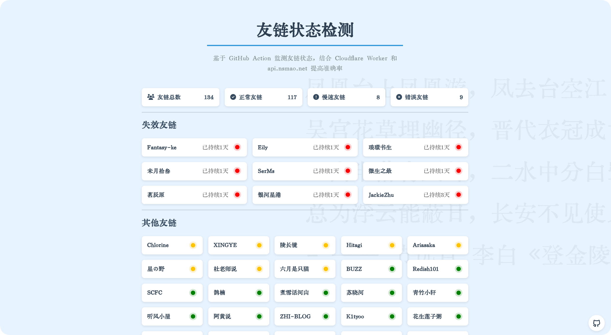

---

> 近期进行了重构，将两种检测放在了一起，所有需要配置的数据放在了环境变量中，如果需要csv格式，请自行新建csv文件，这样不会影响上游直接同步内容，如果更新请根据下面的说明进行修改！

# 友情链接自动检查项目

[示例页面](https://check-flink.qyliu.top) | [详细教程](https://blog.liushen.fun/posts/c2262998/)

这个项目旨在自动检查从互联网上托管的 JSON 文件中的链接的可访问性。它利用 GitHub Actions 来定期调度检查，并将结果输出为 JSON 文件，可以部署到如 Vercel 等平台以便于访问。该项目基于并改进了 [butterfly-check-links](https://github.com/shangskr/butterfly-check-links.git) 项目。

## 功能

- 使用 GitHub Actions 进行自动链接检查
- 支持使用 `HEAD` 和 `GET` 请求进行链接验证
- 并发处理以提高链接检查效率
- 结果输出为 JSON 格式，便于与 Web 应用集成
- 使用 cron 作业进行定时执行
- 使用 Cloudflare Worker 和 xxapi 提高检测准确率
- 可以统计连续失效次数，方便站长进行判断

> 注意，该项目结果仅供参考，可能会因为各种原因无法检测到对应站点数据，请不要将该数据作为友链可达性的唯一评判标准

## 主要文件结构

```plaintext
.
├── .github
│   └── workflows
│       └── check_links.yml
├── main.py
├── .env  # 环境变量文件，可以设置在仓库机密中。
├── result.json
├── link.csv  # 可选，如有需要，自行创建
└── README.md
```

## 文件说明

- `.github/workflows/check_links.yml`: GitHub Actions 的工作流配置文件，用于定时执行链接检查脚本。
- `main.py`: 主链接检查脚本，负责检查来源数据中的链接可访问性并生成结果。
- `result.json`: 链接检查结果的输出文件。
- `link.csv`: 存放待检查链接的文本文件(可选方式之一)。
- `README.md`: 项目说明文件。

## 使用说明

### 1. 复刻仓库

首先，复刻这个仓库到你的 GitHub 账户，命名随意。

### 2. 环境配置

#### （1）配置仓库权限

在 GitHub 仓库的设置中，确保 Actions 有写权限，步骤如下：

1. 打开你的 GitHub 仓库，点击右上角的“Settings”。
2. 在左侧栏中找到并点击“Actions”。
3. 选择“General”。
4. 在“Workflow permissions”部分，选择“Read and write permissions”。
5. 点击“Save”按钮保存设置。

### 3. 选择抓取方式

#### （1）JSON（比较复杂，但是后续无需再在仓库中修改，等于维护一个在线友链列表，如果可以实现，强烈推荐）

- 在变量中设置`SOURCE_URL`，链接填写`json`文件链接地址，比如：

  ```env
  SOURCE_URL=https://blog.liushen.fun/flink_count.json
  ```

- 具体所需JSON文件格式示例：

  ```json
  {
    "link_list": [
      {
        "name": "String",
        "link": "String",
        "avatar": "String",
        "descr": "String",
        "siteshot": "String"
      },{
        "name": "String",
        "link": "String",
        "avatar": "String",
        "descr": "String",
        "siteshot": "String"
      },
    ],
    "length": 100
  }
  ```

- JSON 具体生成教程请看[详细教程](https://blog.liushen.fun/posts/c2262998/)。

#### （2）csv（简单，全适用）

- 在变量中设置`SOURCE_URL`，链接填写`csv`文件链接地址，可以是相对地址或者网络地址，比如：

  ```env
  SOURCE_URL=./link.csv # 相对于项目根目录
  ```

- 创建并修改 `link.csv` 中的内容，格式如下，请修改为你自己的数据：

  ```plaintext
  清羽飞扬,https://blog.liushen.fun/
  ChrisKim,https://www.zouht.com/
  Akilar,https://akilar.top/
  张洪Heo,https://blog.zhheo.com/
  ```

  本项目提供了示例数据，如果不清楚可以进行修改以匹配。

**注**：两种抓取方式最终获得结果相同，所以不影响后面的操作。

尝试运行action后，如果没有问题，结果应该出现在 `page` 分支。

### 4. 提升准确率

由于该脚本通过action进行，可能会出现由于各种原因导致准确率极低的现象发生，此时我们需要通过各种方式提升检测的准确率，本脚本内置了通过[奶思猫API](https://api.nsmao.net/)和[CloudFlare Worker](https://www.cloudflare.com/zh-cn/)转发的方式，可以分别应对屏蔽国外，以及使用国外CDN且防火墙屏蔽Github的两种情况，经过实测，最终准确率基本达到100%。

启用两种方式非常简单，仅需要设置对应的环境变量即可。

1. **小小API**:

   > 2025-04-23更新：使用xxapi，可以无需token进行请求，本项目已进行限速，对api请求每秒不超过10次，通常为5次（并行上限一秒十次，api请求每个请求之间相隔0.2s）

   小小api已经默认内置，无需任何配置，如有违反产品条例，请联系我删除。

   API仅在直接访问，代理访问均无法请求的情况下，进行检测，并且经过了严格的兵法限制，不会造成大规模大量快速请求。

   ~~打开[奶思猫API](https://api.nsmao.net/)并在右上角注册完成，进入控制台。进入控制台后，点击左边的密钥管理，生成密钥。~~

   <!--  -->

   ~~然后再在仓库设置->secret->action中，添加`LIJIANGAPI_TOKEN`（原名是梨酱API，改名了懒得换了QAQ，注意变量别错了）的密钥即可自动启用。~~

2. **CloudFlare Worker**：

   其实上面的xxapi就可以达到很高的准确率了，如果仍然有部分站本身能访问却无法检测，你可以尝试使用下面的方式进行检测：

   首先部署转发代理，具体教程可以点击[查看文章](https://blog.liushen.fun/posts/dd89adc9/)，不需要绑定域名，因为github action本身就是国外环境。

   然后添加密钥`PROXY_URL`，设置密钥即自动启用。

### 5. 部署前端页面

在 Vercel 或 Zeabur 选择对应仓库，按照以下步骤进行操作：

1. **登录 Vercel 或 Zeabur**：
   - 如果还没有账户，请先注册一个 Vercel 或 Zeabur 账户。
   - 登录后进入仪表板。

2. **导入 GitHub 仓库**：
   - 点击“New Project”或“Import Project”按钮。
   - 选择“Import Git Repository”。
   - 连接到您的 GitHub 账户，并选择该链接检查项目的仓库。

3. **配置项目**：
   - 确保选择正确的分支（page）。
   - 对于 Vercel，在“Build and Output Settings”中，确保 `output.json` 文件在构建输出目录中。

4. **部署项目**：
   - 点击“Deploy”按钮开始部署。
   - 部署完成后，Vercel 或 Zeabur 会生成一个 URL，您可以使用这个 URL 访问部署的网页。

使用zeabur或者vercel部署的目的是加快结果文件国内访问并且展示最终结果， Vercel 或 Zeabur 平台可以跟随仓库更新实时同步内容，配合上前端的缓存和异步加载，哪怕是国内访问也可以得到非常好的体验，可以在我的友链页面测试。

### 6. 进阶操作

该项目最终文件结果为 JSON 格式，通过该文件可以获取最新的链接检查结果。您可以使用任何支持 HTTP(S) 请求的编程语言或工具来获取此 JSON 数据，API 地址如下（用本站部署的作为示例）：

```txt
https://check-flink.qyliu.top/result.json
```

#### `result.json` 格式：

```json
{
    "timestamp": "2024-09-19 09:18:49",
    "accessible_count": 64,
    "inaccessible_count": 12,
    "total_count": 76,
    "link_status": [
        {
            "name": "清羽飞扬",
            "link": "https://blog.qyliu.top/",
            "latency": -1,
        },
        {
            "name": "ChrisKim",
            "link": "https://www.zouht.com/",
            "latency": 0.76,
        },
        {
            "name": "Akilar",
            "link": "https://akilar.top/",
            "latency": 3.31,
        }
    ]
}
```

#### 展示到单页HTML：

通过 `Javascript` 获取无法访问链接数据的简单页面示例（代码仅供参考，可以参考展示页面的js代码实现或自行实现）：

```javascript
    fetch('./result.json')
        .then(response => response.json())
        .then(data => {
            // 提取整体统计信息
            const summary = `总数: ${data.total_count} | 可访问: ${data.accessible_count} | 不可访问: ${data.inaccessible_count}`;
            document.getElementById('summary').textContent = summary + ` | 检测时间: ${data.timestamp}`;

            // 动态生成表格数据
            const tbody = document.getElementById('link-table-body');
            data.link_status.forEach(item => {
                const row = document.createElement('tr');

                // 名称列
                const nameCell = document.createElement('td');
                nameCell.textContent = item.name;
                row.appendChild(nameCell);

                // 链接列
                const linkCell = document.createElement('td');
                const linkElement = document.createElement('a');
                linkElement.href = item.link;
                linkElement.target = "_blank";
                linkElement.textContent = item.link;
                linkCell.appendChild(linkElement);
                row.appendChild(linkCell);

                // 时延列
                const latencyCell = document.createElement('td');
                latencyCell.textContent = item.latency >= 0 ? item.latency.toFixed(2) : '不可达';
                row.appendChild(latencyCell);

                // SSL 状态列
                const sslCell = document.createElement('td');
                sslCell.textContent = item.ssl_status ? '✔️' : '❌';
                row.appendChild(sslCell);

                tbody.appendChild(row);
            });
        })
        .catch(error => {
            console.error('Error loading JSON data:', error);
            const tbody = document.getElementById('link-table-body');
            const row = document.createElement('tr');
            const cell = document.createElement('td');
            cell.colSpan = 4;
            cell.textContent = '无法加载数据';
            cell.style.textAlign = 'center';
            row.appendChild(cell);
            tbody.appendChild(row);
        });
```

#### 展示到友链卡片

除以上展示为单独页面之外，还可以通过JavaScript对比友链结果，生成友链卡片小标签，大致效果可以看[清羽飞扬の友链页面](https://blog.liushen.fun/link/)，示例代码如下：

```html
<style>
    .status-tag {
        position: absolute;
        top: 0px;
        left: 0px;
        padding: 3px 8px;
        border-radius: 12px 0px 12px 0px;
        font-size: 12px;
        color: white;
        font-weight: bold;
        transition: font-size 0.3s ease-out, width 0.3s ease-out, opacity 0.3s ease-out;
    }
    .flink-list-item:hover .status-tag {
        font-size: 0px;
        opacity: 0;
    }
    /* 固态颜色 */
    .status-tag-green {
        background-color: #005E00; /* 绿色 */
    }
    .status-tag-light-yellow {
        background-color: #FED101; /* 浅黄色 */
    }
    .status-tag-dark-yellow {
        background-color: #F0B606; /* 深黄色 */
    }
    .status-tag-red {
        background-color: #B90000; /* 红色 */
    }
</style>
<script>
function addStatusTagsWithCache(jsonUrl) {
    const cacheKey = "statusTagsData";
    const cacheExpirationTime = 30 * 60 * 1000; // 半小时
    function applyStatusTags(data) {
        const linkStatus = data.link_status;
        document.querySelectorAll('.flink-list-item').forEach(card => {
            if (!card.href) return;
            const link = card.href.replace(/\/$/, '');
            const statusTag = document.createElement('div');
            statusTag.classList.add('status-tag');
            let matched = false;
            // 查找链接状态
            const status = linkStatus.find(item => item.link.replace(/\/$/, '') === link);
            if (status) {
                let latencyText = '未知';
                let className = 'status-tag-red'; // 默认红色
                if (status.latency === -1) {
                    latencyText = '未知';
                } else {
                    latencyText = status.latency.toFixed(2) + ' s';
                    if (status.latency <= 2) {
                        className = 'status-tag-green';
                    } else if (status.latency <= 5) {
                        className = 'status-tag-light-yellow';
                    } else if (status.latency <= 10) {
                        className = 'status-tag-dark-yellow';
                    }
                }
                statusTag.textContent = latencyText;
                statusTag.classList.add(className);
                matched = true;
            }
            if (matched) {
                card.style.position = 'relative';
                card.appendChild(statusTag);
            }
        });
    }
    function fetchDataAndUpdateUI() {
        fetch(jsonUrl)
            .then(response => response.json())
            .then(data => {
                applyStatusTags(data);
                const cacheData = {
                    data: data,
                    timestamp: Date.now()
                };
                localStorage.setItem(cacheKey, JSON.stringify(cacheData));
            })
            .catch(error => console.error('Error fetching test-flink result.json:', error));
    }
    const cachedData = localStorage.getItem(cacheKey);
    if (cachedData) {
        const { data, timestamp } = JSON.parse(cachedData);
        if (Date.now() - timestamp < cacheExpirationTime) {
            applyStatusTags(data);
            return;
        }
    }
    fetchDataAndUpdateUI();
}
setTimeout(() => {
    addStatusTagsWithCache('https://check-flink.qyliu.top/result.json');
}, 0);
</script>
```

### 7. 联系作者

如果有疑问可通过[个人主页](https://www.liushen.fun)或者提 issue 进行联系，非常欢迎。
